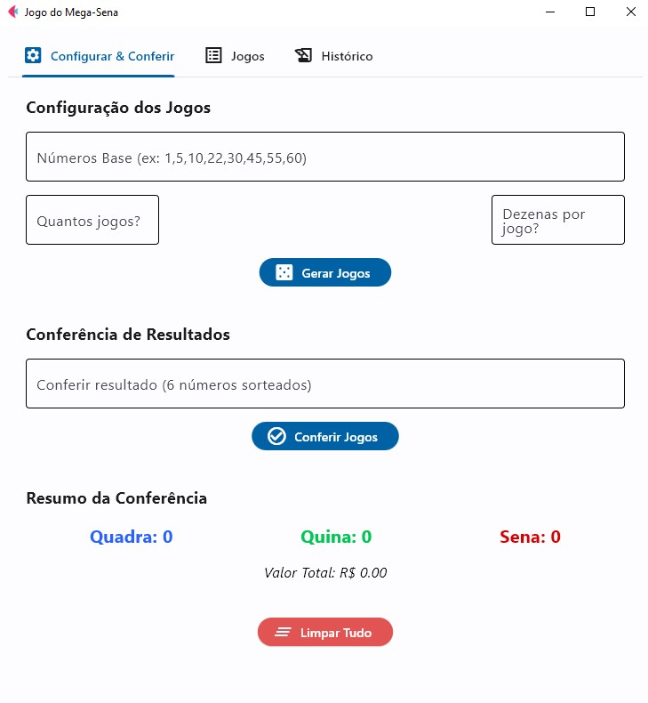

# 🎰 Mega Sena Simulator - Flet/Python

Um simulador interativo da Mega Sena desenvolvido com Python e Flet para geração e análise de jogos, com interface gráfica amigável e funcionalidades avançadas.

 <!-- Adicione sua screenshot aqui -->

## 🚀 Recursos Principais
- **Geração de Jogos Personalizados**
  - Escolha quantidade de números por jogo (6-20)
  - Definição de quantidade de jogos
  - Geração de combinações únicas
- **Sistema de Análise de Resultados**
  - Verificação de quadra, quina e sena
  - Histórico completo de resultados
  - Cálculo automático do valor total
- **Exportação de Dados**
  - Salvamento em TXT na área de trabalho
  - Download direto das listas
  - Histórico exportável
- **Interface Intuitiva**
  - Layout responsivo e organizado
  - Cores indicativas para acertos
  - Feedback visual imediato

## ⚙️ Instalação
**1. Clone o repositório:**
```bash
git clone https://github.com/seu-usuario/mega-sena-simulator.git
cd mega-sena-simulator

**2.Instale as dependências:**
pip install flet pandas openpyxl

**3.Execute o aplicativo:**
python mega_sena.py

**📋 Como Usar**
Configuração Inicial

Insira números base (ex: 1,2,3,4,5...60)

Escolha quantidade de jogos

Selecione números por jogo (6-20)

Geração de Jogos

Clique em "Gerar Jogos"

Visualize as combinações na lista

Análise de Resultados

Insira 6 números para simulação

Clique em "Filtrar bilhetes"

Verifique quadra, quina e sena

Exportação

Use botões de download para salvar:

Listas completas de jogos

Histórico de resultados

Dados em arquivo TXT

**🧩 Estrutura do Projeto**

mega-sena-simulator/
├── mega_sena.py        # Código principal do simulador
├── requirements.txt    # Dependências do projeto
└── README.md           # Documentação

🛠️ Tecnologias Utilizadas
Tecnologia	Função
Python	Lógica principal
Flet	Interface gráfica
📌 Notas Importantes
Valores baseados nas regras oficiais da Caixa Econômica Federal
Atualize os preços conforme edital oficial

**Para remover dependências não utilizadas:**

pip uninstall pandas openpyxl

📄 Licença
Distribuído sob licença MIT. Veja LICENSE para mais informações.

Desenvolvido por Daniel do Nascimento 


